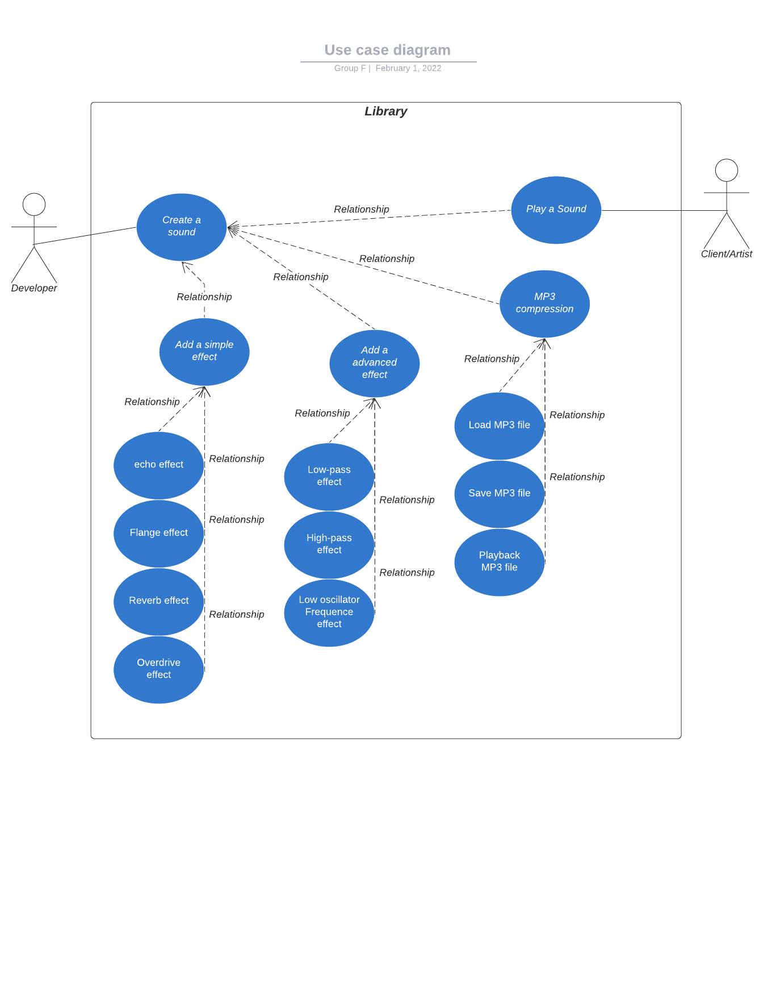

# Group F's Functional Specifications

[](https://fsharp.org)

---

<details>
<summary>Table of Contents</summary>
  
- [Project scope](#project-scope)
    1.[Goals](#goals)
    2.[Features](#features)
    3.[Deadlines](#deadlines)
- [Risk and assumptions](#risk-and-assumptions)
- [Product overview](#product-overview)
- [Uses cases](#uses-cases)
- [Requirements](#requirements)
- [Configuration](#configuration)
- [Non-functional requirements](#non-functional-requirements)

</details>
  
## Project scope

## Goals

For this project we have to create a synthesizer in F#, it is basically an electronic musical instrument that generates audio signals. With this synthesizer it will be possible to modify a waveform, add some effect to the song like echo, reverb, flanger... The audio create at the end must be in MP3 format.
We have created this library with the help of Robert Pickering our professor in F#

## Features

The project is developed in F#.
This project is a library to use a synthetiser. They users are many people who would like use a synthetiser(artist,developer or people in general).

## Deadlines

10,February 2022

## Risk and assumptions

The risk about the technical part is about the music because we think for this project we need a little things about the music,the language use because is a new language for all.
The risk about the group part is the absentism of a member of the group

## Product overview

At the beginning we need the four basic waveform(sine,square,triangle and sawtooth).To make this we have create four function for each waveform with each calcul different to each wave.

When you create a file it was save at the same place of the program to be use after.

To play a sound without saving it you need just the function PlaySound with this you just play the sound create but you don't save it.

## Uses cases



For a simple developer for example you download the nuggets simple to have the library of the sound synthetiser after that you implement the simple effect like echo,overdriven,reverb,... do you want and you can play the sound or the music to test and save it in a format MP3 or just load a music inside the library and just change the effect of this music

For an advanced developer it's the same say before but you have more effect for example the high-pass and the low pass filter. Modify the amplitude or the frequence of the low frequency oscillator and analyses the frequency of a sound.

## Requirements

We have three basic filters the echo, the flange effect and the reverberation also we have a filter to modify the wave amplitude by a fixed amount. Firstly this modification you need to have a parameter for the amplitude.
To make the overdriven you need a loop for to make the effect on all of the sound.
An overdrive is the name given to an audio effect that aims to recreate the distortion of an electric guitar amplifier pushed to its gain limits. It usually has less gain than distortion.
An echo is when the sound was repeat less loud.
A flange is when the wave was repeat with a late of 20 milliseconds but this late was catch up and this effect was repeat during all of the sound.

In sound synthesis, an envelope is generated for each note, to describe the evolution of the volume within the note. Its shape has an important impact on the style of instrument being synthesised.A chord is a superposition of at least three different notes. Chords can be played by a polyphonic instrument, such as the piano, organ, guitar, etc., or by three monodic instruments

## Configuration

To run this project you need an IDE, we have chosen to use [Visual Studio Code](https://code.visualstudio.com/download).
You should also install [dotnet.6](https://dotnet.microsoft.com/en-us/download)

To execute correctly the project you need to install a library call SFML. This library is used just to open an audio file. So to install it open the terminal and enter the following commands:

```dotnet add package SFML.Net --version 2.5.0```

Then you need to install XPlot to see the wave in a web page. Enter in the terminal the following commands:
```dotnet add package XPlot.GoogleCharts --version 3.0.1```

## Non-functional requirements

If we have the time it possible to create a User Interface for the synthesizer that is possible to show immediately the waves and where it possible with some buttons to add an effect or change the wave with different parameters. Add a compatibility with android and IOS and a keyboard to play a sound or a music directly.
