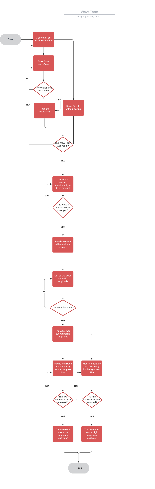

# Software Architecture design group F

---

<strong>Table of Contents</strong>

- [Software Architecture design group F](#Software-Architecture-design-group-F)
  - 1.[`WaveForm part`](#1-waveform-part)
  - 2.[`Sound part`](#2-sound-part)

  

---
# 1. WaveForm part

  We begin by generating a WaveForm. Waveforms have four basic forms (square,sinusoidal,sawtooth,triangle).
  After that we save this WaveForm. If the WaveForm was not saved we try again to save this WaveForm. When the WaveForm was saved you can read them but you can also read a WaveForm directly without saving them.
  If the WaveForm was not read, we regenerate them to be able to read the Wave. When the Wave has been read, you can modify its amplitude.
If the amplitude was not changed, we try again to change the amplitude of the wave. After that, when you change the amplitude you can read the wave with the changes. Afterward you can cut off at a specific amplitude.
  If the wave is not cut off at a specific amplitude you try again the phase. Afterwards when the wave is cut you can modify amplitude and frequency for the low pass filter or for the high pass filter. For the low pass filter we removed the low frequencies. If the low frequencies was not removed you can try to modify the frequency of the wave again. You see if the low frequencies was removed the wave became a low frequency oscillator. For the high pass filter it was the opposite it was the high frequencies removed to have a high frequency oscillator

  

# 2. Sound part
  We begin to create or download an audio. After that we see if we can read the audio. If we can't we verify the location of the file.
  When the audio play we can add an echo, a flange effect filter and a reverb effect. If each effect don't work we try to add all of them again. When all of them work you can play an audio with all effect. Afterwards we create a wrapper to implement the MP3 compression if the wrapper doesn't work we try the phase of wrapper again.
