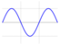
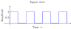
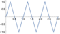
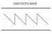
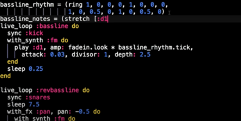
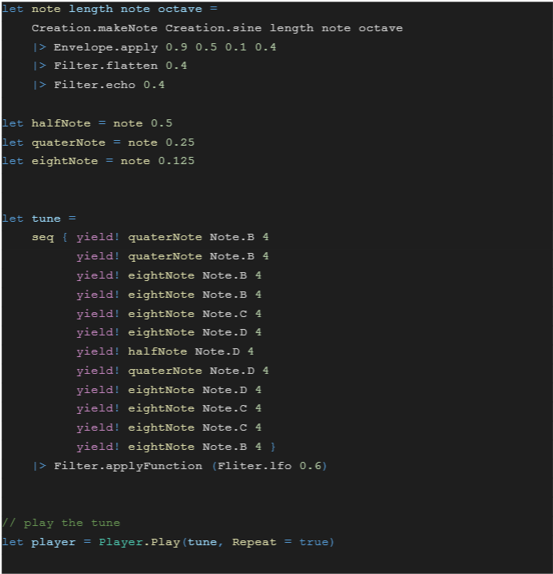
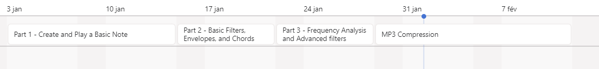

<h1> Technical Specification</h1>

---

Table of Contents

  
- [1. Front matter](#1-front-matter)
- [2. Introduction](#2-introduction)
  - [a. Overview](#a-overview)
  - [b. Terminology](#b-terminology)
  - [c. Product and Technical Requirements](#c-product-and-technical-requirements)
  - [d. Out of Scope](#d-out-of-scope)
  - [e. Future Goals](#e-future-goals)
- [3. Solution](#3-solution)
  - [a. Existing Solution](#a-existing-solution)
  - [b. Design](#b-design)
  - [c. Test Plan](#c-test-plan)
- [4. Work](#4-work)
  - [a. Work estimates and timelines](#a-work-estimates-and-timelines)
  - [b. Prioritization](#b-prioritization)
  - [c. Milestones](#c-milestones)
  - [- A function to play the waveform directly without saving it to disk](#--a-function-to-play-the-waveform-directly-without-saving-it-to-disk)
- [8. End Matter](#8-end-matter)
  - [a. References](#a-references)
  - [b. Acknowledgments](#b-acknowledgments)

---
# 1. Front matter 
The Project name is **F# Project - Sound Synthesis** 

This Project is create by a team composed of 
- Théo Trouvé 
- Eloi Priol 
- Elise Gautier
- Robin Debry
- Romain Nicolaon
- Thomas Planchard  

# 2. Introduction
## a. Overview
Developers are many issues if they want to create in **.NET** programmable music or add filters to an existing music. It doesn't really exist a recent **Library** to do that. The libraries are already exist are not updated since 4-5 years. So our mission is to create a Library in .NET to ->
- Create the 4 basic wave forms (sine, square, sawtooth and triangle)
- Play a song
- Save a waveform to disk 
- Read a section of an audio file from disk
-  Modify the wave’s amplitude by a fixed amount
- Cut off the wave at specific amplitude to given the “overdriven” often used in rock songs
- Add echo to the sound
- Add a chords effect 
- Add a flange effect filter
- Add a reverb effect filter
- Create an envelope
- Create a Spectroscope 
- Create a low pass and high pass filter 
- Create a LFO 
- Create a mp3 compression 

## b. Terminology
This project is based on the music so they have many words that people who arent't in the music industry don't know. This misunderstanding can block you for the developping so we explain some technical terms 
| Words | Meaning |
|-|-|
|Waveform| The waveform is a wave who design a sound. There are 4 differents types of wave:     ↑ The sine wave ↑  ↑ The square wave ↑    ↑ The triangle wave ↑     ↑ The sawtooth wave ↑|
|Overdrive effect | This effect must cut of the points of the wave  who go after the parameter enter by the user and replace them by the parameter wikipedia link : https://fr.wikipedia.org/wiki/Overdrive_(effet)|
|Echo| Echo effects are one type of audio effect based on delaying a signal over time. In this case, listeners perceive an audible repetition of a signal after some duration of time.Listeners perceive distinct echoes when the time delay is relatively long (greater than ~30 milliseconds). wikipedia link: https://en.wikipedia.org/wiki/Echo|
|Flange |it's a music effect get to add on the original signal the same signal with a delay wikipedia link : https://fr.wikipedia.org/wiki/Flanger#:~:text=Le%20flanger%20est%20un%20effet,%2C1%20et%2020%20Hz%20) |
|Reverb| A reverb effect, or reverb, is an audio effect applied to a sound signal to simulate reverberation. It may be created through physical means, such as echo chambers, or through digital processing wikipedia link : https://en.wikipedia.org/wiki/Reverb_effect |
|Envelope| The sound envelope is the curve describing the evolution of a property of a sound (for example the volume) as a function of time. wikipedial link : https://fr.wikipedia.org/wiki/Enveloppe_sonore|
|Spectroscope| It's a tool to show the peak frequency of each wave of a music |
|Low and high pass filter| Both are an effect to remove high or low frequencies from music.|
|LFO| LFO is a very low frequency oscillation generator, used in music to control slow and periodic modulations on a sound signal. wikipedia link : https://fr.wikipedia.org/wiki/Low_frequency_oscillator|
## c. Product and Technical Requirements
| Technical | Using |
|-|-|
|F#| We code in F# because it's the language that we learning at this time and like it's a .NET language this library can be used in C#, C++ and VB |
|OS| This library can be used on Mac and Windows as we have these two different operating systems in our groups.|
|Visual Studio Code |We use VSCode for this project because it's less complicated to work on it in F# |
|SFML |We use this library to help use for save and play waveforms. |
|Xplot| We use Xplot to display the wave. Xplot is a library  |
|.NET.6| We use this version of .NET because is the latest version and the more efficient version|

## d. Out of Scope
For this project we don't need to do a music just the tool to make it so don't waste your time to do a music. Then it's just a library don't make an UI or something graphical. 

## e. Future Goals 
For the future version we can add 
- more effect like the loops effect
- the octave of each note
- samples already created 
# 3. Solution 
## a. Existing Solution 
The most popular tool for developer who want to code music it's **sonic Pi** https://sonic-pi.net/. Sonic pic it's a tool to code any music like this video show : https://www.youtube.com/watch?v=G1m0aX9Lpts&t=254s 

## b. Design
This is a example that we want :
 
Many functions with no to much information. The name of functions and the parameters should be explicit for the users.
Our team have decided to create this project with this architecture :
- ALGOSUP_2022_Project_3_F
- FSharpSynthe.sln
- src
  - App (to test our function only for developper)
  - Library
    - Playsound.fs
    - CreateWave.fs
    - DisplayWave.fs
    - Envelope.fs
    - Filter.fs
    - Spectroscope.fs
    - MP3.fs
  - Test
  - Examples (to stock examples of music create with the library)
## c. Test Plan
For this project we opted for the TDD methode during all the project 
# 4. Work
## a. Work estimates and timelines

## b. Prioritization
The first thing that you need to do are the four basic wave forms and understand how it constructs without that you can't advance in the project. Here are the 4 formula for waves.
- sine : amp * sin(calc*x) | calc = 2. * Pi * freq 
- square :  amp * float(sign(sin(i*calc)))
- triangle : amp * 2. * asin( sin( 2.* Pi * x * freq))/ Pi
- sawtooth :  amp * 2. * ( i * freq - floor(0.5 + i*freq))

## c. Milestones
Part 1 - Create and Play a Basic Note  
**Delivery date**: 14 January 2022  
The first step in this project is to create and play a simple note. To complete this module, the
sound synthesiser’s public API should have the following functionalities:
- An oscillator function or functions that can generate the four basic waveforms at variable
audible frequencies. The four basic wave forms are sine, square, triangle and sawtooth.
- A function to save waveform to disk, so it can be played back through a standard audio
application
- A function to read a section of an audio file from disk
- A function to play the waveform directly without saving it to disk
---
Part 2 - Basic Filters, Envelopes, and Chords  
**Delivery date**: 21 January 2022   
A filter is a function that takes a waveform and modifies it someway to produce a modified
sound.  An envelope is a kind of filter used to vary a sound’s amplitude over time, helping to give
it an interesting and more realistic sound. 
A chord is combining two or more waveforms to create a new sound. A chord is similar to a filter
in that it can be seen as one waveform applying a transformation to another.
A filters module should be created to provide the following filters:
- Modify the wave’s amplitude by a fixed amount
- Cut off the wave at specific amplitude to given the “overdriven” often used in rock songs
- Add echo to the sound
- A flange effect filter
- A reverb effect filter

A four stage envelope should be provided with the following parameters: attack, decay, sustain
and release. A basic version of the envelope should
have a linear gradient between each stage, while more advanced envelope implementations will
provide a way to specify nonlinear gradients. 
 A combine function should also be provided to combine two or more waves into a chord. 

---
Part 3 - Frequency Analysis and Advanced filters  
**Delivery date**: 28 January 2022  
A spectroscope analyses the frequency of a sound sample. This can then be used to create a
low pass or high pass filter. A low pass filter removes low frequency sounds while a high pass
filter removes high frequency sounds. A module with parameterized low and high pass filters
should be provided.
  An LFO, low frequency oscillator, is a type of filter used to change a sound over time. The
waveform of the LFO is not applied directly to the target waveform, but the waveform of the LFO
is used to modify the amplitude or the frequency of the target sound. A module should be
provided with both an AM and FM LFO.

---
 Part 4 - MP3 Compression

**Delivery date**: 11 February 2022  
The WAV format is popular because it’s easy to use, but the resulting files can be very large.
This is a disadvantage for both storage and network transfer.  The MP3 format became popular
because it can store the same sounds in a file that’s about a factor of 10 smaller than the
equivalent WAV. The format meant that songs could be much more easily shared over networks
and played back on small portable devices, so the format became a catalyst behind the digital
music revolution.
 A module to load, save, playback MP3 files should be provided. It should also be possible to
use all the filters and other sound tools with the MP3s once they are loaded.
 Just creating a wrapper around an existing MP3 library should be avoided in favour of
implementing the MP3 compression algorithm

# 8. End Matter
## a. References
https://learnxinyminutes.com/docs/fr-fr/fsharp-fr/
https://github.com/SFML/SFML.Net 
https://fslab.org/XPlot/ 
https://fsharp.org/docs/ 
https://docs.microsoft.com/en-us/dotnet/fsharp/language-reference/
## b. Acknowledgments

- Théo Trouvé 
- Elise Gautier
- Robin Debry
- Romain Nicolaon
- Thomas Planchard  

